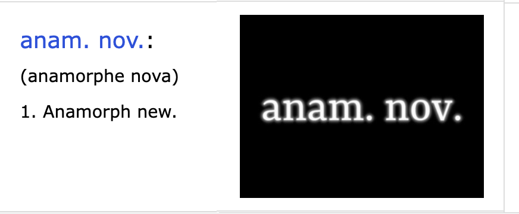

# MO Glossary of Mycological Terms

The Glossary is a community-maintained list of mycological terms.

<details>
<summary>Background</summary>

The MO Glossary began in 2015 in collaboration with the Rhode Island School of Design;
students from Jean Blackburn’s Scientific Illustration class created
high-quality Creative Commons licensed scientific illustrations
of fungal anatomy terms.

The Glossary has since been improved to:

- support multiple images including both scientific illustrations and example photographs.
- include a search feature; and
- support internal links to terms as part of any Mushroom Observer markup.

One feature that needs discussion is how best to handle translations
of terms and definitions.
Discussion is welcome on the
[Mushroom Observer Google Group]([mo-general@googlegroups.com](https://groups.google.com/g/mo-general)).
You are also welcome to leave comments on the
[unofficial Mushroom Observer Facebook page](https://www.facebook.com/groups/mushroomobserver).
(But note that the facebook page is not monitored by the MO Development Team.)
</details>

## Guidelines

Please follow these Guidelines when creating or editing Glossary Terms.

### Who can contribute?

The glossary entries are created and edited by members of the MO community.
(No individual member owns any entry.) Everyone is welcome to contribute.

### Terms to Include

- Mycology-specific terms are welcome, especially terms relating to
   the identification, taxonomy, nomenclature, and ecology of macrofungi.

- Avoid terms that lack a mycology-specific definition.
   <details>
   <summary>Examples</summary>

   bad: `Acrid`

   bad: `Acute`

   bad: `Agar`

   bad: `Alkaloid`

   bad: `Calcareous`

   bad: `Cell`

   bad: `Cell Biology`

   bad: `Chemical Species`

   bad: `Chirality`

   bad: `Climate Change`

   bad: `rhombus`

   bad: `Science`

   bad: `Scientific Methodology`

   good: `character`

   good: `club fungi`
   </details>

- Terms that are straightforward modifications or combinations of other terms
   should not have their own definitions,
   but are welcome to be given entries with illustration(s).

   <details>
   <summary>Examples</summary>

   bad:  `Academic Mycology`

   bad:  `Lamellae Edge With Gelatinous, Separable Layer`

   bad:  `Oblong With Median Constriction`

   bad:  `Round To Angular Pores`

   bad:  `Transition Between Hymeniderm And Epithelium`

   good: `Lugol's Solution`

   good: `adnate`
   (plus exampble showing adnate gills)
   </details>

- Avoid terms that are scientific names of taxa.
   Instead, add a Description to the taxon Name.

   <details>
   <summary>Examples</summary>

   bad:  `Agaricales`

   bad:  `Basidiomycota`

   bad: `Eukarya`

   good: `bolete`
   </details>

   <!--
   ["Agaricales",
    "Basidiomycota",
    "Lichen",
    "Subulicystidium",
    "Eukarya",
    "Agaricomycetes",
    "Myxomycetes",
    "Conifer",
    "Plasmodium",
    "Gloeocystidium",
    "Hypha",
    "Oidium",
    "Ozonium",
    "Ascomycete",
    "Bacteria",
    "Dermatophyte",
    "Agaricales",
    "Chytridiomycota",
    "Flora",
    "Slime mold",
    "Glomeromycota",
    "Cyanobacteria",
    "Lepiotoid",
    "Lichenicolous",
    "Mold",
    "Fungus",
    "Agaricales",
    "Foliose",
    "Crustose",
    "Rotula"]
   -->

## Titles

- Titles (the "Name" field) should be lowercase, except for proper nouns or
   other terms that are capilitalized in ordinary use.
   <details>
   <summary>Examples</summary>
   <div style="background-color: rgb(80, 80, 80);">

   bad:  `Bolete`

   good: `bolete`

   good: `RPB2`
   </div>
   </details>

- Prefer shorter terms.
  (This improves the functionality and performance of Glossary links and
  searches, and is kinder to users with small screens.)

## Descriptions

Each term must have a Description and/or Illustration(s).

### Definitions

A Description may include a definition.

- Definitions should be original (not copied).

- Definitions should be complete sentences or
   (preferably) match the part of speech of the term they define.
   E.g., a definition for a noun might begin with "A sterile cell that..." and
   one for an adjective might begin with "Bearing cystidia that..."

- Stick to the definition, avoiding history, background, everything you found out
   when researching the topic, etc.

   <details>
   <summary>Examples</summary>
   <div style="background-color: rgb(80, 80, 80);">

   ```text
      bad:  Casing Layer
            1. When mushrooms are cultivated indoors or outdoors,
            they are often developed using a layered system involving a variety of
            potential materials. The casing layer is the top-most layer which
            covers all of the layers. It can be composed of moist materials such
            as peat, gypsum, vermiculite, and/or several other optional materials.
            This moisture-promoting layer dramatically enhances mushroom formation
            as well as more abundant mushroom growth in most cultivated species.
            Some mushroom species require a casing layer in order to fruit,
            or to fruit with any significance.

      good: Casing Layer
            The top-most layer of material used in indoor mushroom cultivation.
   ```

   </div>
   </details>

- Number definitions if (and only if) multiple definitions are included.

- Optionally precede the definition with a parenthesized list of cognates,
   alternate spellings, and synonyms.

- Don't repeat definitions. Instead link to an existing Glossary Term
   that includes that definition.

   <details>
   <summary>Example</summary>

   bad:

   ```text
         Spiciform:

            1. Exhibiting spike-shaped projections.

         Spicules:

         (Spiculate, Spiculose, Spiculum)

            1. Exhibiting many small spines.

            2. Small spikes.
   ```
   good:

   ```text
         spiciform:

            Having _spicules_.

         spicules:

            (spiculate, spiculose, spiculum, spiciform)

            Small spikes or spines.
   ```
   </details>

- Optionally follow the defintion with ***short*** examples
   ***only if needed to show context***.

## Illustrations

- Preferably include an illustration.
- Omit "illustrations" which are simply text.
  <details>
  <summary>Example</summary>

   

  </details>
- Use only illustrations that:
   you created,
   are in the public domain, or
   are licensed.
   Comply with the license terms if you use licensed illustrations.
- Limit the number and size of illustrations
  to those that are necessary to define the term.

## Internal Links to the Glossary

- Use all lower-case words exactly matching the term, surrounded by underscores.

>`_bolete_` (renders as ***bolete***)

- To render the link in different cases use this format:

>`_term Bolete_` (renders as ***Bolete***)

## Glossary Searches

The Glossary can be searched via the search bar at the top of the screen.
Searches do not require an exact match; they return a list of all
Glossary Terms matching the search criteria.
